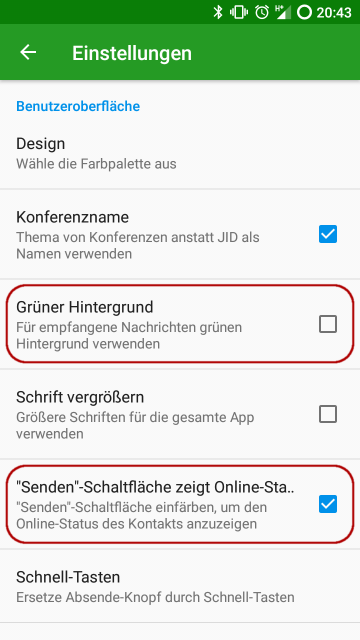
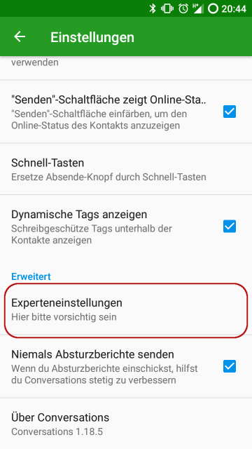
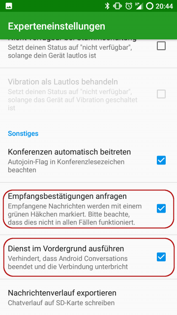

# Conversations Einstellungen optimieren

In meinem letzten Post habe ich beschrieben, warum und wie man XMPP
verwenden kann. Doch fast immer wenn jemand das erste Mal
Conversations startet, gibt es ein paar Einstellungen, die man gerne
anpasst. In diesem Post möchte ich diese Optionen vorstellen und
zeigen, wie ihr sie ändern könnt.

## Grüner Hintergrund

Wenn man eine verschlüsselte Nachricht empfängt, zeigt Conversations
diese mit einem grünen Hintergrund an, um einem zu signalisieren,
dass die Unterhaltung sicher ist. Mich persönlich stört allerdings
die verringerte Lesbarkeit, deutlich mehr, als dass mir der grüne
Hintergrund nützt. Deshalb deaktiviere ich diese Option gerne.

Wenn eine unverschlüsselte Nachricht empfangen wird, wird diese auch
weiterhin mit einem roten Hintergrund kenntlich gemacht.

## Online Status

Mit den Standardeinstellungen von Conversations ist es häufig nicht
direkt ersichtlich, ob ein Kontakt gerade online bzw. erreichbar
ist. Es gibt allerdings die Einstellung `"Senden"-Schaltfläche zeigt
Online-Status`, mit der sich dies ändern lässt. Wenn man diese
aktiviert, kann man in jedem Chat immer direkt am "Senden" Knopf
sehen, ob der Empfänger gerade online ist.

## Experteneinstellungen

Wenn man in den Experteneinstellungen einen Fehler macht, kann dies
dazu führen, dass Conversations nicht mehr ordnungsgemäß
funktioniert. Doch hier gibt es auch Optionen, die für einfachste
Anwendungsfälle relevant sind. Die Experteneinstellungen findet man,
wenn man in den normalen Einstellungen ganz nach unten scrollt.

### Empfangsbestätigungen

Wie auch in anderen Messagern gibt es auch bei Conversations
Empfangsbestätigungen. Allerdings muss man diese natürlich auch
richtig zu lesen wissen: Eine vorhandene Empfangsbestätigung
bedeutet, dass eines der Geräte (Smartphone, Tablet, PC) des
Empfängers die Nachricht bekommen hat. Nicht jedoch, dass der
Empfänger die Nachricht gelesen hat.

Eine nicht vorhandene Empfangsbestätigung bedeutet jedoch relativ
wenig, denn es kann sogar sein, dass der Empfänger die Nachricht
gelesen hat, jedoch nur die Empfangsbestätigung bei der Übertragung
verloren ging.

Die Option befindet sich in den Experteneinstellungen ganz unten.

### Dienst im Vordergrund ausführen

Auf einigen Smartphones wird Conversations vom Betriebssystem
beendet, um Energie zu sparen. Dadurch kann Conversations allerdings
keine Nachrichten mehr empfangen. Mit der Option `Dienst im
Vordergrund ausführen` kann man dafür sorgen, dass Conversations
immer aktiv bleibt. Da Conversations selbst sehr gut dafür optimiert
ist, so wenig Energie wie möglich zu verbrauchen, halte ich es für
sinnvoll diese Option zu aktivieren, wenn Freunde Dir mitteilen,
dass Du nicht online bist, obwohl Du meinst, dass Du online sein
müsstest.

Ich persönlich konnte noch keine negativen Auswirkungen auf den
Akkuverbrauch durch die Aktivierung dieser Option feststellen,
allerdings wird dadurch immer eine Nachricht im
Benachrichtigungsbereich von Android angezeigt, die man nicht haben
möchte, wenn es nicht sein muss.

# Zusammenfassung

Mit Ausnahme der Option `Dienst im Vordergrund ausführen`, empfehle
ich alle hier aufgeführten Optionen bei jeder Conversations
Installation anzupassen. Vielleicht haben wir auch Glück und in
einer zukünftigen Version von Conversations werden die Standardwerte
dieser Optionen angepasst.
