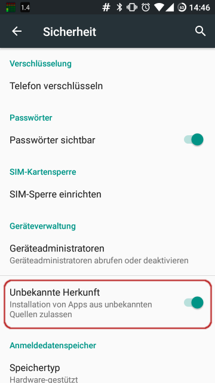

# Warum nicht WhatsApp und Co

Heutzutage gibt es Instant Messager wie Sand am Meer: WhatsApp,
Signal, Telegram und Co. sind alles Alternativen zur Ablösung der
SMS.

Tatsächlich haben aber alle Systeme Vor- und Nachteile. Während die
neuen Systeme alle durch die Bank günstiger sind, haben sie alle
damit zu kämpfen, dass sie nicht einfach da sind, sondern man sie
erst installieren muss und dadurch nicht jeder sie einfach hat (wie
z.B.  die SMS). 

Allerdings gibt es einen zentralen Faktor, der allen gemein ist: Es
sind nicht standardisierte, geschlossene Systeme, die von einzelnen
Firmen entwickelt werden.

Damit unterscheiden sich die Instant Messager von anderen Internet
Technologien wie beispielsweise dem WWW oder der E-Mail. Denn bei
der E-Mail gibt es zwar auch mehrere Anbieter (GMX, Web, Google,
Hotmail, etc.), diese erlauben es aber, dass man mit anderen
Anbietern interagieren kann. So kann man z.B. von einem Konto bei
GMX eine E-Mail an eine Adresse bei Hotmail schicken. Bei den
Instant Messagern hingegen ist es nicht möglich, von einem WhatsApp
Konto eine Nachricht an ein Telegram Konto zu senden.

Was die Sicherheit angeht, sind die neuen Systeme der SMS
grundsätzlich überlegen. Allerdings birgt es eine gewisse Gefahr in sich,
wenn ein komplettes System von einer einzigen Firma entwickelt und betrieben wird.
So wäre es beispielsweise denkbar, dass eine dieser Firmen eine Sicherheitslücke
in ihre App einbaut, über die sie die beworbene Verschlüsselung
brechen und dadurch wieder Gespräche belauschen können.
Ebenso haben sie auch den vollen Zugriff auf sämtliche Metainformationen 
(z.B. wann wird eine Nachricht versendet und an wen ging diese).

# Was ist XMPP

Genau wie die E-Mail gibt es aber auch für Instant Messaging eine
Technologie die standardisiert und offen ist:
[XMPP](https://en.wikipedia.org/wiki/XMPP) (früher Jabber)

Besonders wichtig am Namen ist das X, denn es steht für eXtensible
(zu dt. erweiterbar). Es bedeutet, dass XMPP so gebaut ist, dass es
sich im Laufe der Zeit an neue Anforderungen anpassen kann. Und von
dieser Eigenschaft wird auch Gebrauch gemacht, denn es gibt
inzwischen über 300 Erweiterungen zur ursprünglichen Version.

Aber die wohl wichtigste Eigenschaft von XMPP ist, dass es bei XMPP
mehrere Anbieter gibt, die miteinander kommunizieren (genau wie bei
der E-Mail).

Dadurch hat kein Einzelner die Kontrolle über das gesamte System
und kann es auch nicht so einfach zum Abhören von Gesprächen nutzen.

# Wie kann ich XMPP nutzen?

Zur Benutzung benötigt man zwei Dinge:

1. einen Anbieter (Provider)
2. einen Client (App/Software)

## Anbieterwahl

Meinen Freunden empfehle ich immer `jabber.de` als Anbieter. Man
kann sich aber auch einen anderen aus den folgenden Listen raussuchen:

- [https://list.jabber.at](https://list.jabber.at)
- [https://www.jabberes.org/servers/](https://www.jabberes.org/servers/)

Wie auch bei der E-Mail bekommt man von seinem Anbieter eine
Adresse, die am Ende die Domain des Anbieters hat. Max Mustermann
würde sich zum Beispiel die Adresse `Max.Mustermann@jabber.de` bei
jabber.de holen.

Wie man seinen Account erstellt ist unterschiedlich bei den
verschiedenen Anbietern. Bei Jabber.de geht es über den Browser:

[https://www.jabber.de/anmeldung/](https://www.jabber.de/anmeldung/)

## Der Client

Clients gibt es quasi für alle Plattformen, allerdings ist die Qualität
sehr unterschiedlich. Eine [Liste](https://de.wikipedia.org/wiki/Liste_von_XMPP-Clients)
aller Clients kann man bei Wikipedia finden. Der aus meiner Sicht
beste XMPP Client aktuell ist `Conversations`. Je nach Plattform
kann ich einen Client aus der folgenden Liste empfehlen:

- Android: [Conversations](https://play.google.com/store/apps/details?id=eu.siacs.conversations&hl=en)
- iPhone/iPad: [ChatSecure](https://itunes.apple.com/us/app/chatsecure/id464200063)
- PC/Laptop: [Pidgin](https://pidgin.im)

### Converations installieren

Der einfachste Weg ist Conversations für einmalig 2,39€ im [Playstore](https://play.google.com/store/apps/details?id=eu.siacs.conversations&hl=en)
zu kaufen. Dadurch bekommt man automatisch die neusten Updates und
unterstützt die weitere Entwicklung (schnell & gut).

Alternativ kann man auch den kostenlosen Weg wählen, der aber
deutlich aufwändiger ist und auch keine automatischen Updates
unterstützt. Dafür muss man als erstes in den Optionen im Bereich
Sicherheit die Option Unbekannte Herkunft (Installieren von Apps aus
unbekannten Quellen) aktivieren:

Anschließend kann man von der Seite [f-droid.org](https://f-droid.org)
den F-Droid App-Store installieren ([apk](https://f-droid.org/FDroid.apk)).

Nun kann man F-Droid öffnen. Nach dem ersten Starten dauert
es meistens einen Moment, bis die App die neusten Paketlisten
heruntergeladen hat (vorher sieht der App Store aus, als wenn es
keine Apps gäbe).

Anschließend kann man nach "Conversations" suchen und es
installieren. Da Conversations kontinuierlich weiterentwickelt wird
und F-Droid keine automatischen Updates installiert, empfiehlt es
sich alle paar Wochen F-Droid zu starten und zu schauen, ob es ein
Update gibt.

Dieser Weg ist vollkommen legal, da es sich bei Conversations um
eine Open-Source App handelt, aber der Entwickler freut sich
bestimmt, wenn er von Zeit zu Zeit 2,39€ für seine App bekommt
;-)

### Converations einrichten

Die Einrichtung von Conversations kann man gut auf der Seite von
Jabber.de lesen: [Conversations-Guide](https://www.jabber.de/clients/android-ios/conversations-guide/)

# Wie geht es weiter?

Damit Dich Freunde zu ihrer Kontaktliste hinzufügen können,
benötigen sie (wie bei der E-Mail) deine XMPP Adresse (dieses Ding
mit dem @). Also gut merken und weitersagen ;-)

Außerdem gibt es in Conversations ein paar Einstellungen die ich
häufig gleich am Anfang anpasse. Welche das sind und weshalb ich sie
ändere, kannst Du in meinem [nächsten Blog Eintrag](#!posts/Conversations-Options)
erfahren.

